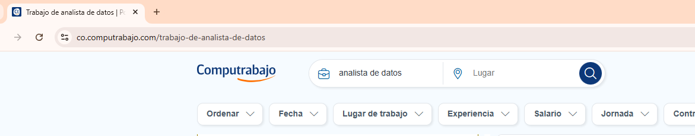
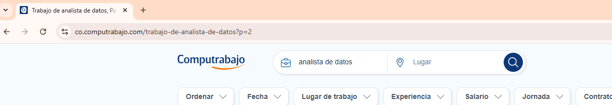

# 🕷️ Web Scraping de Ofertas de Trabajo en Computrabajo

Este proyecto realiza scraping de ofertas de trabajo para el rol de **"Analista de Datos"** desde el sitio [Computrabajo](https://co.computrabajo.com). El script extrae información relevante como el título de la oferta, la empresa, la ubicación, el salario, y un enlace a los detalles de cada oferta. Luego guarda los datos en un archivo CSV.

---

## 📦 **Requisitos**

Antes de ejecutar el script, asegúrate de tener instaladas las siguientes librerías de Python:

```bash
pip install requests beautifulsoup4 pandas
```

---

1. **Ejecuta el script**:

   ```
    web_scrapping_computrabajo.ipynb
   ```

2. **Introduce el número de páginas** que deseas scrapear cuando se te solicite.

3. El script generará un archivo `Ofertas_Computrabajo.csv` con los datos extraídos.

---

## 📝 **Formato de la URL en Computrabajo**

Computrabajo organiza sus páginas de resultados de la siguiente manera:

1. **Página Principal** (primera página de resultados):

   

   - URL de la primera página:
     ```plaintext
     https://co.computrabajo.com/trabajo-de-analista-de-datos
     ```

2. **Páginas Siguientes** (paginación):

   

   - URL para la segunda página y siguientes:
     ```plaintext
     https://co.computrabajo.com/trabajo-de-analista-de-datos?p=2
     ```

El parámetro `p` en la URL indica el número de página. El script utiliza esta estructura para recorrer múltiples páginas automáticamente.

---

## 📝 **Descripción del Código**

### 📜 **Funcionamiento del Script**

1. **Configuración Inicial**
   - Se define la URL base de Computrabajo y los encabezados (`User-Agent`) para evitar bloqueos por parte del servidor.

2. **Scraping de Ofertas**
   - Se recorre un número de páginas especificado por el usuario.
   - Para cada oferta, se extraen los siguientes datos:
     - **Título**
     - **Empresa**
     - **Ubicación**
     - **Salario**
     - **Enlace** a los detalles de la oferta.

3. **Pausas Aleatorias**
   - Se introducen pausas de entre 1 y 3 segundos entre solicitudes para evitar bloqueos por el servidor.

4. **Obtención de Descripciones**
   - Actualmente, el DataFrame incluye los campos: Título, Empresa, Ubicación, Salario y Enlace de la oferta. 
     Sin embargo, en este caso tambien vamos a agregar también la Descripción para tener mas datos.

     En Computrabajo, para acceder a la descripción completa de una oferta, es necesario "dar click" en la oferta específica,
     lo que implica realizar un scraping dinámico. 

     Dado que BeautifulSoup solo puede manejar datos estáticos, no es adecuado para esta tarea. Para interactuar con 
     elementos dinámicos como botones de clic, sería necesario utilizar herramientas como Selenium, que permite 
     automatizar acciones en el navegador.

     En este enfoque, accederemos a cada uno de los enlaces extraídos y obtendremos la descripción de cada oferta 
     para luego añadirla al DataFrame.

5. **Almacenamiento de Datos**
   - Los datos se almacenan en un archivo CSV llamado `Ofertas_Computrabajo.csv`.

---

## 📊 **Resultado del Script**

El archivo CSV generado `Ofertas_Computrabajo.csv` tendrá el siguiente formato:

| Título                      | Empresa           | Ubicación        | Salario       | Enlace                               | Descripción                   |
|------------------------------|-------------------|------------------|---------------|--------------------------------------|--------------------------------|
| Analista de Datos Junior    | Empresa X         | Bogotá, Colombia | $2.500.000    | https://co.computrabajo.com/...      | Descripción de la oferta...   |
| Analista de Datos Senior    | Empresa Y         | Medellín, Antioquia | $4.000.000 | https://co.computrabajo.com/...      | Descripción de la oferta...   |

---

## ⚠️ **Consideraciones y Limitaciones**

1. **Cambios en la Estructura del Sitio**:
   - El scraping depende de la estructura HTML de Computrabajo. Si este sitio cambia su estructura, el script puede necesitar ajustes.

2. **Bloqueos del Servidor**:
   - Para evitar ser bloqueado, se introducen pausas aleatorias entre solicitudes. Sin embargo, si se realizan demasiadas solicitudes en poco tiempo, el servidor podría bloquear la IP.

3. **Descripción Dinámica**:
   - Obtener la descripción completa de cada oferta requiere acceder a cada enlace individual. Este proceso puede ser lento y, en algunos casos, puede requerir **Selenium** para manejar el scraping dinámico.

---

## 🚀 **Mejoras Futuras**

- **Incorporar Selenium** para realizar scraping dinámico y extraer la descripción de ofertas que requieren interacción.
- **Optimización de Desempeño** para reducir el tiempo de scraping.
- **Manejo Avanzado de Errores** para reintentar solicitudes fallidas

---

## 🏁 **Conclusiones**

Este script es una herramienta útil para recopilar datos de ofertas de trabajo en Computrabajo de manera automatizada. Aunque actualmente se limita al scraping estático con **BeautifulSoup**, puede mejorarse para manejar contenido dinámico con **Selenium**.

Este proyecto proporciona una base sólida para la automatización de recopilación de datos y puede adaptarse a otras plataformas o necesidades específicas.

---

